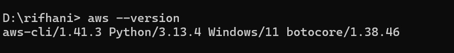

# Laporan Praktikum  
## Simulasi Layanan AWS Menggunakan LocalStack 

###  PENDAHULUAN 

A. latar belakang   

    LocalStack merupakan sebuah platform open-source yang dirancang untuk meniru berbagai layanan AWS secara lokal di lingkungan pengembangan. Dengan menggunakan Docker sebagai basisnya, LocalStack memungkinkan para pengembang untuk membangun, menguji, dan menjalankan aplikasi berbasis layanan AWS tanpa harus terkoneksi langsung dengan cloud AWS yang sesungguhnya. Hal ini memberikan keuntungan besar dalam hal efisiensi waktu dan biaya, terutama selama proses pengembangan dan debugging. Dalam praktikum ini, fokus utama adalah mempelajari bagaimana LocalStack dapat digunakan untuk menyimulasikan layanan-layanan seperti Amazon S3 untuk penyimpanan file, AWS Lambda untuk fungsi serverless, Amazon DynamoDB sebagai database NoSQL, serta API Gateway untuk menerima data dari sensor.
---

B. Tujuan Praktikum 

Tujuan dari pratikum ini adalah: 

-   Mensimulasikan layanan AWS secara lokal tanpa biaya.

-   Mempercepat proses pengujian dan pengembangan aplikasi.

-   Mendukung pengujian tanpa koneksi internet (offline).

-   Menghindari risiko penggunaan layanan AWS langsung saat tahap awal.

-   Memudahkan integrasi dengan alat seperti AWS CLI dan Terraform.
C. Dasar Teori
    merupakan salah satu platform layanan cloud terbesar yang menyediakan berbagai infrastruktur dan layanan seperti penyimpanan data (S3), komputasi serverless (Lambda), basis data NoSQL (DynamoDB), dan API Gateway. Dalam pengembangan aplikasi berbasis cloud, layanan-layanan ini sering digunakan untuk membangun sistem yang fleksibel dan skalabel. Namun, mengakses layanan AWS secara langsung selama tahap pengembangan dapat memerlukan biaya dan koneksi internet yang stabil. Untuk mengatasi hal tersebut, LocalStack hadir sebagai solusi open-source berbasis Docker yang memungkinkan pengembang mensimulasikan layanan AWS secara lokal. Dengan menjalankan LocalStack di lingkungan lokal, pengembang dapat membangun, menguji, dan memverifikasi aplikasi tanpa harus terhubung langsung ke layanan AWS yang sebenarnya. Hal ini mendukung praktik Infrastructure as Code (IaC) dan mempercepat siklus pengembangan perangkat lunak modern.

###  D. Alat dan Bahan  
- Laptop/PC dengan OS Linux/Windows/macOS  
- Docker  
- Python 3.x  
- AWS CLI  
- LocalStack  
- Flask dan Boto3  
- Editor teks atau IDE (VS Code, PyCharm, dll)  
- Internet untuk instalasi paket

###  E. Langkah-Langkah Praktikum
1.  Pratikum
    Perintah ini digunakan untuk menjalankan LocalStack dalam mode latar belakang (detached) dan memetakan port 4566 pada container ke port 4566 di komputer lokal. Port ini adalah port default yang digunakan oleh LocalStack untuk menyediakan layanan AWS lokal seperti S3, Lambda, dan DynamoDB. Setelah perintah dijalankan, Docker menghasilkan sebuah ID container yang panjang (40bbeae9cf10...), 

